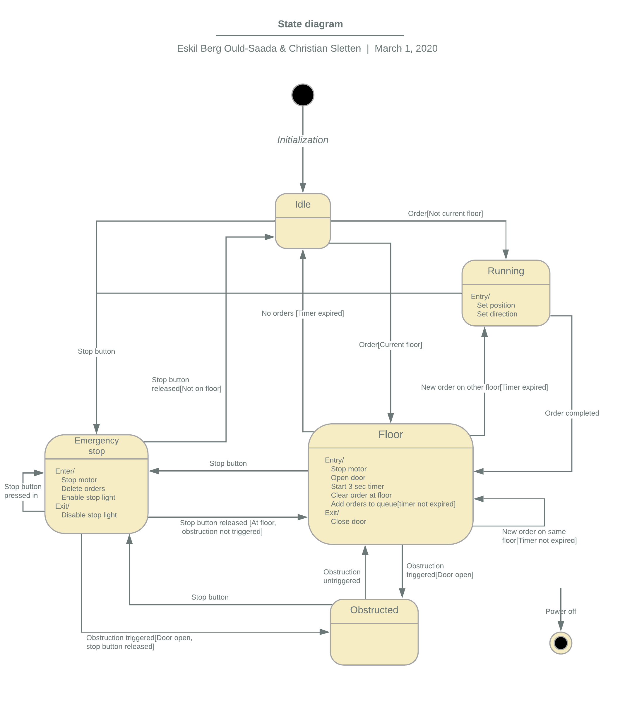

# Elevator Project in TTK4235 - Embedded Systems

Implementation of an elevator simulator written in C.
Created in collaboration with Eskil Berg Ould-Saada.

## Running the program

To run the program one must compile the code. This is performed using the command ```make``` in the CLI while the current directory is set to be inside the project directory.

To execute the program a GCC compiler is required. Use the command ```./build``` to execute the program.

## Architecture

The state diagram of the elevator system is shown below. The elevator moves between the states *Idle*, *Running*, *Floor*, *Emergency stop* and *Obstructed*. The transitions between the states are also described in the state diagram.



## Code

The system is split into six modules described below.

#### main
The **main** module is responsible for running the elevator and terminating the elevator process when necessary.

#### elevator
The **elevator** module contains the state machine for the elevator system. The module keeps track of the state of the elevator in addition to the current floor of the elevator.

#### orders
The **orders** module handles the queuing system for the elevator orders. 

#### lights
The **lights** module handles the lights in the system. This involves turning off and on lights related to the current floor of the elevator and the order lights both inside and outside the elevator.

#### timer
The **timer** module handles the timer that ensures that the doors of the elevator are open for a certain amount of time when reaching a floor.


